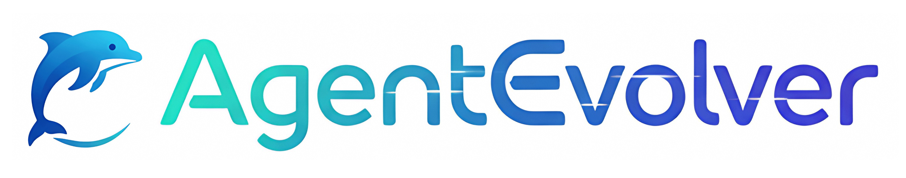
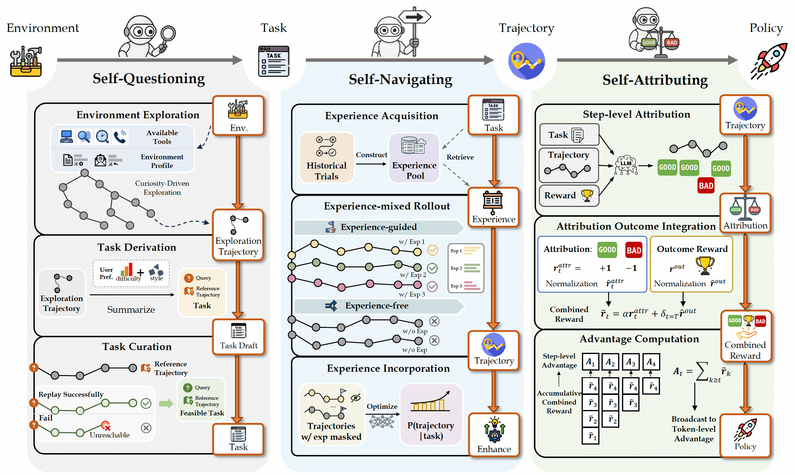
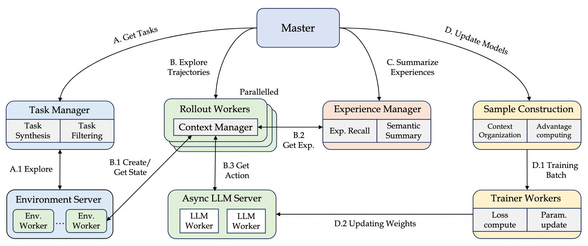
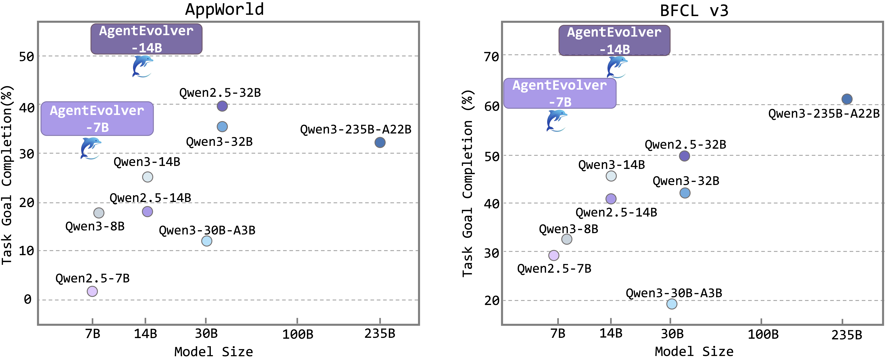
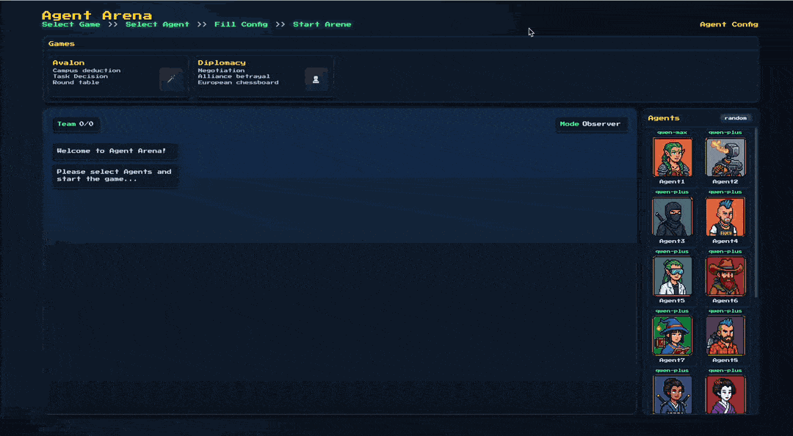
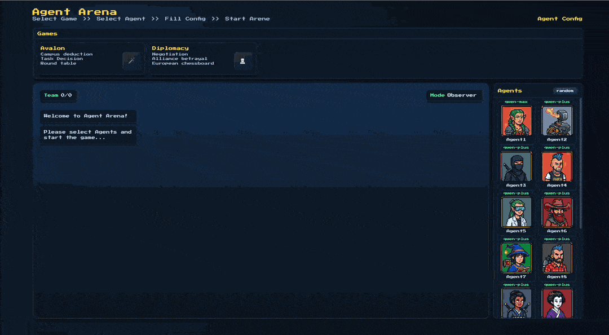
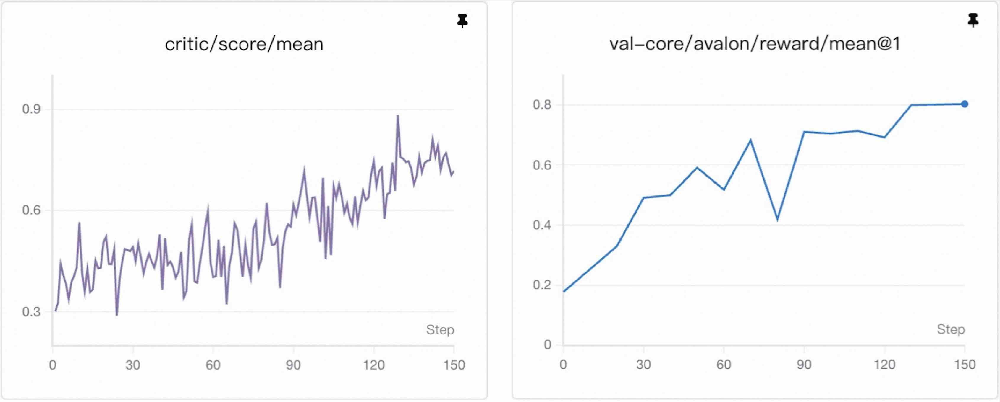

<p align="center">
 
</p>
<h2 align="center">AgentEvolver: Towards Efficient Self-Evolving Agent System</h2>

<!-- --- -->

<p align="center">
  <!-- <a href="https://arxiv.org/abs/0000"></a> -->
  <a href="https://www.python.org/"></a>
  <a href="./LICENSE"></a>
  <a href="https://modelscope.github.io/AgentEvolver/"></a>
  <a href="https://arxiv.org/abs/2511.10395"></a>
  <a href="https://deepwiki.com/modelscope/AgentEvolver"></a>
  <a href="https://github.com/modelscope/AgentEvolver"></a>
</p>


<!-- <p align="center">
  <strong>AgentEvolver: An Efficient Self-Evolving Agent System</strong><br>
</p> -->

**AgentEvolver** is an end-to-end, self-evolving training framework that unifies self-questioning, self-navigating, and self-attributing into a cohesive system. It empowers agents to autonomously
improve their capabilities, aiming for efficient, cost-effective, and continuous capability evolution.


## 📰 News

- **[2026-03]** ⚡ [SeeUPO](https://github.com/modelscope/AgentEvolver/tree/seeupo) released — Sequence-Level Agentic RL with convergence guarantees; multi-turn training stack built on AgentEvolver
- **[2025-12]** 🎮 [AgentEvolver Game Arena](games/README.md) released — a multi-agent social reasoning arena for interaction, evaluation, and training in games like Avalon and Diplomacy.
- **[2025-12]** 📢 New preprint [CuES](https://www.arxiv.org/abs/2512.01311) on an extended self-questioning method released with [code](research/CuES/README.md).
- **[2025-11]** 📄 [The AgentEvolver Technical Report is now available](https://arxiv.org/abs/2511.10395), detailing the framework's architecture, methodology, and key findings.
- **[2025-11]** 🧩 AgentEvolver v1 has been released now!


## ✨ Why AgentEvolver


🧠 AgentEvolver provides three **Self-Evolving Mechanisms** from Environment to Policy:

- **Automatic Task Generation (Self-Questioning)** – Explore the environment and autonomously create diverse tasks, eliminating costly manual dataset construction.
- **Experience-guided Exploration (Self-Navigating)** – Summarize and reuse cross-task experience, guiding higher-quality rollouts and improving exploration efficiency.
- **Attribution-based Credit Assignment (Self-Attributing)** – Process long trajectories to uncover the causal contribution of intermediate steps, enabling fine-grained and efficient policy optimization.

<p align="center">
 
</p>


## 🔧 Architecture Design
AgentEvolver adopts a service-oriented dataflow architecture, seamlessly integrating environment sandboxes, LLMs, and experience management into modular services.

<p align="center">
 
</p>


- **Environment Compatibility** – Standardized interfaces for seamless integration with a wide range of external environments and tool APIs.
- **Flexible Context Manager** – Built-in utilities for managing multi-turn contexts and complex interaction logic, supporting diverse deployment scenarios.
- **Modular & Extensible Architecture** – Decoupled components allow easy customization, secondary development, and future algorithm upgrades.


## 🌟 Benchmark Performance

Performance comparison on the AppWorld and BFCL-v3 benchmarks. AgentEvolver achieves superior results while using substantially fewer parameters than larger baseline models.

<p align="center">
 
</p>

Performance on two benchmarks. Columns show avg@8 and best@8 for each benchmark, plus their averages (Avg.). All values are in percent (%). **Bolded numbers** highlight the best results.

| **Model** | **Params** | **AppWorld** | | **BFCL v3** | | **Avg.** | |
|:---|:---:|:---:|:---:|:---:|:---:|:---:|:---:|
| | | avg@8 | best@8 | avg@8 | best@8 | avg@8 | best@8 |
| Qwen2.5-7B | 7B | 1.8 | 5.6 | 29.8 | 42.4 | 15.8 | 24.0 |
| +Questioning | 7B | 23.2 | 40.3 | 49.0 | 60.6 | 36.1 | 50.5 |
| +Questioning&Navigating | 7B | 26.3 | 43.1 | 53.3 | 61.0 | 39.8 | 52.1 |
| +Questioning&Attributing | 7B | 25.7 | 43.7 | 56.8 | 65.3 | 41.3 | 54.5 |
| **AgentEvolver (overall)** | **7B** | **32.4** | **51.2** | **57.9** | **69.0** | **45.2** | **60.1** |
| | | | | | | | |
| Qwen2.5-14B | 14B | 18.0 | 31.4 | 41.6 | 54.1 | 29.8 | 42.8 |
| +Questioning | 14B | 44.3 | 65.5 | 60.3 | 72.1 | 52.3 | 68.8 |
| +Questioning&Navigating | 14B | 45.4 | 65.3 | 62.8 | 74.5 | 54.1 | 69.9 |
| +Questioning&Attributing | 14B | 47.8 | 65.6 | 64.9 | 76.3 | 56.4 | 71.0 |
| **AgentEvolver (overall)** | **14B** | **48.7** | **69.4** | **66.5** | **76.7** | **57.6** | **73.1** |


## 🚀 Quick Start
### Step 1. Basic Dependency Installation

Make sure you have **conda** and **cuda toolkit** installed.

Then, set up the training environment by running the script

```bash
bash install.sh
```


### Step 2. Setup Env-Service (Appworld as example)
The script below sets up an environment for appworld.

```bash
cd env_service/environments/appworld && bash setup.sh
```

### Step 3. Setup ReMe (Optional)
Set up the ReMe for experience management by running the script:
```bash
bash external/reme/install_reme.sh
```
For more detailed installation, please refer to [ReMe](https://github.com/agentscope-ai/ReMe).

### Step 4. Begin Training! 🚀 🚀
Copy the `example.env` file to `.env` and modify the parameters, including your **API key**, **conda path**.

Using AgentEvolver launcher to start environment, log dashboard and training process altogether.

```bash
conda activate agentevolver

# option 1: minimal example without ReMe (using built-in datasets within environments)
python launcher.py --conf examples/basic.yaml --with-appworld

# option 2: full example with ReMe (questioning + navigating + attributing)
python launcher.py --conf examples/overall.yaml --with-appworld --with-reme
```

Alternatively, you can use bash scripts for manual execution: `bash examples/run_basic.sh` or `bash examples/run_overall.sh`. See [Advanced Usage](#-advanced-usage) for more details.


## 🎮 AgentEvolver Game Arena

**[AgentEvolver Game Arena](games/README.md)** extends **AgentEvolver** into **multi-agent social game environments**, providing a unified arena for **interaction, evaluation, and training** of AI agents in long-horizon social reasoning tasks.

Key capabilities include:
- **Web-based interaction** – Observe AI agents' reasoning and communication in real time, or participate as a human player.
- **Scalable evaluation** – Run large-scale self-play or mixed-model tournaments with configurable settings and leaderboards.
- **End-to-end training support** – Train LLM agents directly within social game environments using reinforcement learning–based methods (e.g., GRPO).

**Web Interface Demo:**

<table style="border: none; border-collapse: collapse;">
<tr>
<td align="center" width="50%" style="border: none; text-align: center;">
  
  <br><strong>Avalon</strong>
</td>
<td align="center" width="50%" style="border: none; text-align: center;">
  
  <br><strong>Diplomacy</strong>
</td>
</tr>
</table>

**Training Example:** Training curve for the assassin role in Avalon

<p align="center">

</p>

For detailed documentation, quick start guides, and configuration examples, see the **[Game Arena README](games/README.md)**.


## 🧩 Advanced Usage

### 🔧 Manual Execution

For users requiring fine-grained control over the training pipeline, we provide standalone execution scripts: 

- `bash examples/run_basic.sh` - Execute basic RL pipeline with GRPO using built-in datasets within environments.
- `bash examples/run_overall.sh` - Run the complete self-evolving AgentEvolver pipeline with fully customizable configurations.

Refer to the  **[QuickStart](docs/tutorial/quick_start.md)** for detailed usage instructions and configuration parameters.

### 📄 Documentation

For detailed usage and customization, please refer to the following guidelines:

- **[Environment Service](docs/guidelines/env_service.md)** - Set up and manage environment instances, integrate custom environments
- **[Task Manager](docs/guidelines/task_manager.md)** - Explore environments, generate synthetic tasks, and curate training data for agent evolution
- **[Experience Manager](docs/guidelines/exp_manager.md)** - Configure experience pool management and self-navigating mechanisms
- **[Advantage Processor](docs/guidelines/adv_processor.md)** - Implement self-attributing mechanisms with ADCA-GRPO for fine-grained credit assignment

For API documentation and more details, visit our [documentation site](docs/index.md).

## 🔮 Upcoming
- **Evolution in multi-agent scenarios** – Investigate autonomous co-evolution strategies for agents operating within shared, interactive environments.
- **Cross-stage collaborative self-evolution** – Explore methods that couple questioning, navigating, and attributing into coordinated loops for mutual enhancement.

<!-- ## 🌟 Contact Us -->

## 🙏 Acknowledgements
This project builds upon the excellent work of several open-source projects:

- [ReMe](https://github.com/agentscope-ai/ReMe) - for experience summarization and management;
- [veRL](https://github.com/volcengine/verl) - for distributed RL training;
- [mkdocs](https://github.com/mkdocs/mkdocs) - for documentation.

## 📚 Citation
If you find this work useful, please consider citing:

```bibtex
@misc{AgentEvolver2025,
  title         = {AgentEvolver: Towards Efficient Self-Evolving Agent System},
  author        = {Yunpeng Zhai and Shuchang Tao and Cheng Chen and Anni Zou and Ziqian Chen and Qingxu Fu and Shinji Mai and Li Yu and Jiaji Deng and Zouying Cao and Zhaoyang Liu and Bolin Ding and Jingren Zhou},
  year          = {2025},
  eprint        = {2511.10395},
  archivePrefix = {arXiv},
  primaryClass  = {cs.LG},
  url           = {https://arxiv.org/abs/2511.10395}
}
```


## ✨ Star History

[](https://www.star-history.com/#modelscope/AgentEvolver&type=date&legend=top-left)
