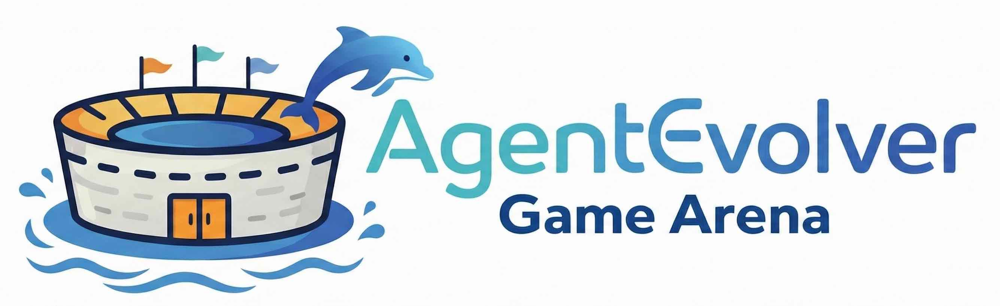
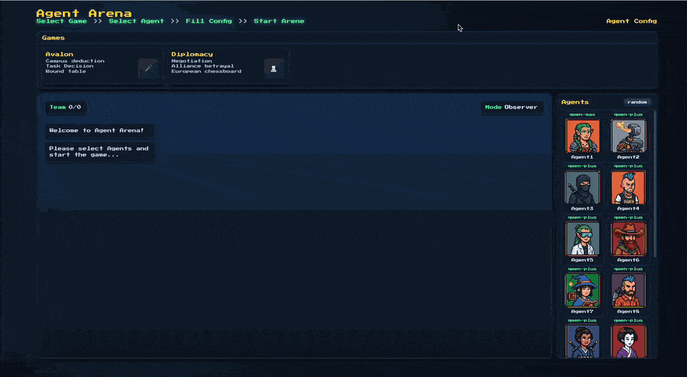
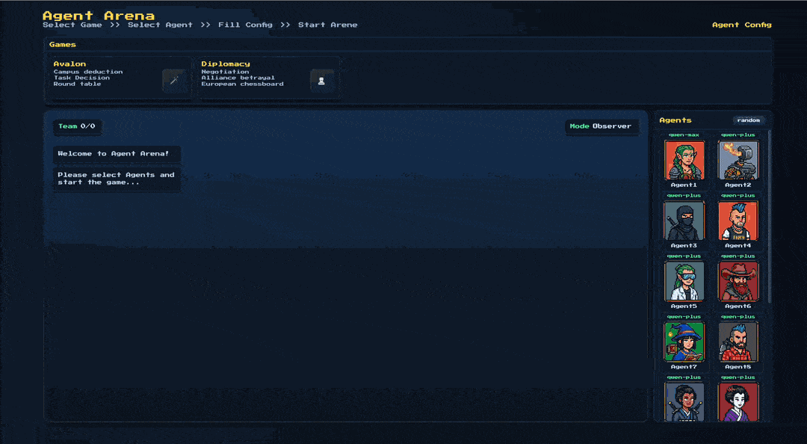
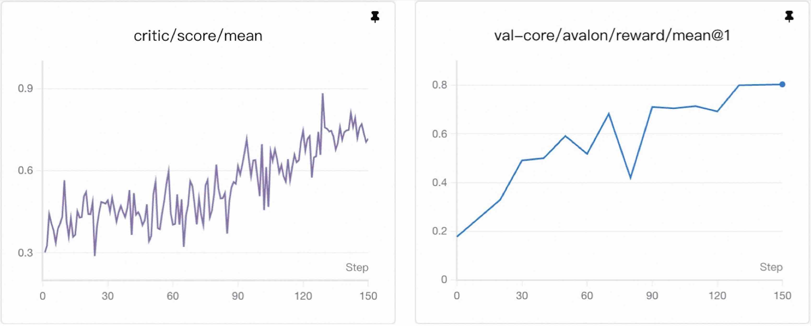

<p align="center">
 
</p>


# 🎮 AgentEvolver Game Arena

**A unified arena for interaction, evaluation, and training of AI agents in social reasoning games.**


AgentEvolver Game Arena extends **AgentEvolver** into multi-agent social game environments. By focusing on board games with **multi-round, long-horizon interaction and clear reward rules**, and rich strategic spaces involving **hidden information, negotiation and deception**, it provides a controlled setting for developing **social and strategic capabilities** beyond task execution and tool use.


## ✨ What Can You Do?

### 1. Watch or Play AI Agents in Your Browser

A web-based interface allows you to:

- **Observer Mode** – Watch AI agents play in real time and inspect their reasoning, communication, and strategic decisions  
- **Participate Mode** – Join a game as a human player and play alongside or against AI agents to test their interactive capabilities  


We currently support two games, Avalon and Diplomacy, both of which are strategy games involving long-term reasoning.

You first need to select a game, then choose your agents, configure the settings, and finally start the arena.

<table style="border: none; border-collapse: collapse;">
<tr>
<td align="center" width="50%" style="border: none; text-align: center;">
  
  <br><strong>Avalon</strong>
</td>
<td align="center" width="50%" style="border: none; text-align: center;">
  
  <br><strong>Diplomacy</strong>
</td>
</tr>
</table>

---

### 2. Evaluate AI Models at Scale

AgentEvolver provides a built-in evaluation framework to **systematically compare model performance**:

- Run multiple games in parallel for statistically meaningful results  
- Control game settings and model assignments via configuration files  

#### ⚔️ AVALON ARENA LEADERBOARD

> **Total Games:** `200` | **Update Time:** `2025-12-18 16:50:15`｜**Game Balance:** `94.7%` (Min: 162, Max: 171)

| **Rank** |    **Model Name**    | **Overall WR** | **Games** | **🧙‍♂️ Merlin** | **🛡️ Servant** | **🗡️ Assassin** | **😈 Minion** | **📈 Avg** |
| :------: | :------------------: | :------------: | :-------: | :-----------: | :-----------: | :------------: | :----------: | :-------: |
|    🥇     |    **qwen3-max**     |   **61.4%**    |    171    |     28.6%     |   **48.3%**   |   **90.2%**    |    72.7%     | **60.0%** |
|    🥈     | **qwen3-235b-a22b**  |   **51.5%**    |    165    |   **42.4%**   |     30.3%     |     80.0%      |    75.0%     |   56.9%   |
|    🥉     |    **qwen-plus**     |   **49.1%**    |    169    |     37.1%     |     27.0%     |     81.8%      |    68.4%     |   53.6%   |
|    4     | qwen2.5-32b-instruct |     45.4%      |    163    |     27.3%     |     25.8%     |     64.7%      |    79.4%     |   49.3%   |
|    5     |    qwen3-30b-a3b     |     39.4%      |    170    |     20.0%     |     28.4%     |     61.1%      |  **83.3%**   |   48.2%   |
|    6     | qwen2.5-14b-instruct |     25.9%      |    162    |     13.9%     |     11.4%     |     46.2%      |    56.7%     |   32.0%   |
|   ---    |         ---          |      ---       |    ---    |      ---      |      ---      |      ---       |     ---      |    ---    |
|    💡     |  **Average (Avg)**   |   **45.5%**    |  **166**  |   **28.0%**   |   **28.0%**   |   **72.0%**    |  **72.0%**   | **50.0%** |


#### ⚔️ DIPLOMACY ARENA LEADERBOARD

> **Total Games:** `100` | **Update Time:** `2025-12-22 19:28:32` ｜ **Game Balance:** `1.000` (Min: 1.000, Max: 1.000)
>
> We use each power’s number of supply centers at game end divided by 18 (solo-victory threshold) as the game score.

| **Rank** |    **Model Name**    | **Overall** | **Games** | **AUSTRIA** | **ENGLAND** | **FRANCE** | **GERMANY** | **ITALY** | **RUSSIA** | **TURKEY** |  **Avg**  |
| :------: | :------------------: | :---------: | :-------: | :---------: | :---------: | :--------: | :---------: | :-------: | :--------: | :--------: | :-------: |
|    🥇     |    **qwen3-max**     |  **0.316**  |    100    |    0.265    |  **0.363**  |   0.324    |  **0.296**  | **0.246** | **0.384**  | **0.318**  | **0.314** |
|    🥈     | **qwen3-235b-a22b**  |    0.306    |    100    |  **0.306**  |    0.306    |   0.312    |    0.294    |   0.243   |   0.340    |   0.309    |   0.301   |
|    🥉     |    **qwen-plus**     |    0.298    |    100    |    0.235    |    0.325    | **0.359**  |    0.286    |   0.230   |   0.366    |   0.274    |   0.296   |
|    4     |    qwen3-30b-a3b     |    0.247    |    100    |    0.272    |    0.204    |   0.231    |    0.286    |   0.200   |   0.298    |   0.231    |   0.246   |
|    5     | qwen2.5-32b-instruct |    0.200    |    100    |    0.190    |    0.203    |   0.229    |    0.184    |   0.163   |   0.213    |   0.208    |   0.199   |
|    6     | qwen2.5-14b-instruct |    0.178    |    100    |    0.150    |    0.185    |   0.211    |    0.160    |   0.185   |   0.170    |   0.183    |   0.178   |
|   ---    |         ---          |     ---     |    ---    |     ---     |     ---     |    ---     |     ---     |    ---    |    ---     |    ---     |    ---    |
|    💡     |  **Average (Avg)**   |  **0.257**  |  **100**  |  **0.238**  |  **0.266**  | **0.283**  |  **0.251**  | **0.206** | **0.297**  | **0.254**  | **0.256** |

---

### 3. Train AI Agents

AgentEvolver is designed to support **end-to-end training of AI agents in social board games**, enabling agents to learn from interaction, feedback, and long-horizon outcomes.

- Training agents directly within game environments  
- Support for reinforcement learning–based methods (e.g., GRPO)  

**Example:** Training curve for the assassin role in Avalon

<p align="center">

</p>

*The training curve above shows the performance of the **assassin** role in Avalon. The assassin uses **qwen2.5-14B** as the base model, while all other roles use **qwen-plus**. All roles use the default **ThinkingReActAgent**, which follows a think-then-speak pattern.*

---

## 🚀 Getting Started

### Install Dependencies

We provide a minimal requirements for non-training usage:

    pip install -r games/requirements_game.txt

(Optional) Set environment variables for using LLM APIs:

    export OPENAI_BASE_URL=your_api_url
    export OPENAI_API_KEY=your_api_key


---

### Launch the Web Interface

Start the server:

    python games/web/server.py

Then open your browser at:

    http://localhost:8000

From the web interface you can:

1. Select a game (Avalon or Diplomacy)  
2. Choose a mode (Observer or Participate)  
3. Configure players and models  
4. Start the game  

---

### Run a Model Evaluation

Run batch evaluations to systematically assess model performance across multiple games:

```bash
python games/evaluation/run_eval.py \
    --game avalon \
    --config games/games/avalon/configs/task_config.yaml \
    --num-games 10 \
    --max-workers 5
```

> To use local models, see introduction in `games/evaluation/run_eval.py`.

**Output:**
Results are displayed in formatted tables with:
- **Game-level statistics**: Aggregated metrics (e.g., win rates, game duration) with mean, max, and min values across all games
- **Role-level statistics**: Performance metrics broken down by role (e.g., Merlin, Servant, Assassin, Minion for Avalon) with mean, max, and min values
- **Summary**: Total number of games completed and overall statistics

🏟️ **For large-scale evaluations** with multiple models, fair model assignment, and Elo-based rankings, see the [Arena Leaderboard documentation](evaluation/leaderboard/README.md).

---

### Train an LLM Agent

**Prerequisites:** Before training, install the required packages using `install.sh` from the project root, and additionally install game-specific dependencies:
```bash
bash install.sh
pip install -r games/requirements_game.txt
```

Training consists of two main steps:

#### Step 1: Generate Training Tasks

Generate training task Parquet files from game-specific training configurations:

```bash
# Generate training tasks for Avalon
python games/generate_train_parquet.py \
    --game avalon \
    --config games/games/avalon/configs/train_config.yaml \
    --output ./train_avalon_tasks.parquet \
    --num_tasks 10
```

The config specifies task details and which roles/models are trainable (set `trainable: true`).


#### Step 2: Start Training

**Option 1: One-click script (Recommended)**

Use the provided training script for quick start:

```bash
# Make sure to update the script with your paths and configuration
bash examples/game/avalon/run_train.sh
```

**Option 2: Python command**

Run the training script directly with Python:

```bash
python -m agentevolver.main_ppo \
    --config-path="examples/game/avalon" \
    --config-name='config' \
    data.train_files="./train_avalon_tasks.parquet" \
    data.val_files="./train_avalon_tasks.parquet" \
    # ... other training parameters
```

> 💡 **Tip**: The script `examples/game/avalon/run_train.sh` contains a complete training configuration. You can modify it to customize training parameters, model paths, and other settings.


## ⚙️ Configuration

Games and evaluations are controlled via **YAML configuration files**. The configuration uses a unified role-based structure where `model` and `agent` configurations are separated but grouped under each role.

### Configuration Structure

- **Game settings** (`game`) – Game-specific parameters (e.g., `num_players`, `language`)
- **Default role** (`default_role`) – Default settings for all roles, containing:
  - `trainable`, `act_by_user` – Role-level flags
  - `model` – Model configuration (API settings, model name, temperature, etc.)
  - `agent` – Agent configuration (type, memory, formatter, toolkit, etc.)
- **Role-specific settings** (`roles`) – Override `default_role` for specific roles. Each role can have:
  - `trainable`, `act_by_user` – Override role-level flags
  - `model` – Override or extend model configuration
  - `agent` – Override or extend agent configuration

**Configuration Priority:** Role-specific settings in `roles` section override `default_role` settings. Nested dictionaries (like `model` and `agent`) are merged recursively, so you only need to specify the fields you want to change.

### Example

    game:
      name: avalon
      num_players: 5
      language: en
    
    default_role:
      trainable: false
      act_by_user: false
      model:
        model_name: qwen-plus
        temperature: 0.7
        max_tokens: 2048
      agent:
        type: ThinkingReActAgent
        kwargs:
          sys_prompt: ""
          memory:
            type: InMemoryMemory
            kwargs: {}
    
    roles:
      assassin:
        model:
          model_name: custom-model  # Only overrides model_name, other model settings inherited
        # agent not specified, uses default_role.agent  


## 🧠 Build Your Own Agents

The AgentEvolver Game Arena is designed to be extensible and customizable. You can:

- **Develop custom agents** - Implement your own agent logic, strategies, and reasoning capabilities. Reference `games/agents/thinking_react_agent.py` and configure via `roles.<role_name>.agent.type` in YAML.
- **Design memory systems** - Build memory architectures that help agents remember game history, player behaviors, and strategic patterns. Create formatters for message formatting and token management. Configure via `roles.<role_name>.agent.kwargs.memory` and `roles.<role_name>.agent.kwargs.formatter` in YAML.
- **Train models** - Use the provided training pipeline to fine-tune models for specific roles, strategies, or game scenarios.

**Configuration Structure:** Each role configuration has separate `model` and `agent` sub-sections, making it easy to customize both independently. The `default_role` section provides defaults for all roles, which can be overridden per-role in the `roles` section.

See `games/games/avalon/configs/default_config.yaml` and `games/games/diplomacy/configs/default_config.yaml` for detailed configuration examples.

Now, try anything you want. Build your own agents, memories, or models. And one day, let's see them meet — and compete — in the arena.


## 🙏 Acknowledgments

We would like to thank the following projects and communities:

- **[AgentScope](https://github.com/modelscope/agentscope)** - For providing the multi-agent framework and infrastructure that powers our agent interactions and evaluations.

- **[Avalon-LLM](https://github.com/jonathanmli/Avalon-LLM)** - For providing the Avalon game engine and state transition logic that form the foundation of our Avalon game implementation.

- **[Diplomacy](https://github.com/diplomacy/diplomacy)** - For providing the Diplomacy game engine and state transition logic, as well as visualization and map-rendering capabilities that form the foundation of our game environment and evaluation setup.

- **[AI_Diplomacy](https://github.com/GoodStartLabs/AI_Diplomacy)** - For providing detailed, well-designed, and practical English prompts that greatly supported the development of our Diplomacy agents and training pipeline.

---

## 📄 License

Please refer to the main project LICENSE file.

## 📚 Citation
If you find this work useful, please consider citing:

```bibtex
@misc{AgentEvolver2025,
  title         = {AgentEvolver: Towards Efficient Self-Evolving Agent System},
  author        = {Yunpeng Zhai and Shuchang Tao and Cheng Chen and Anni Zou and Ziqian Chen and Qingxu Fu and Shinji Mai and Li Yu and Jiaji Deng and Zouying Cao and Zhaoyang Liu and Bolin Ding and Jingren Zhou},
  year          = {2025},
  eprint        = {2511.10395},
  archivePrefix = {arXiv},
  primaryClass  = {cs.LG},
  url           = {https://arxiv.org/abs/2511.10395}
}
```